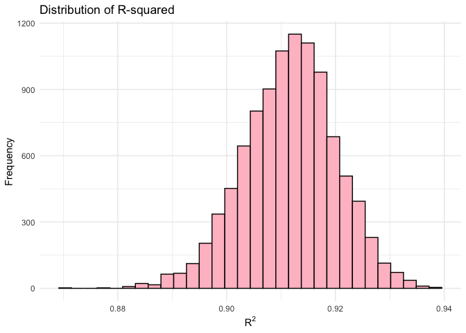
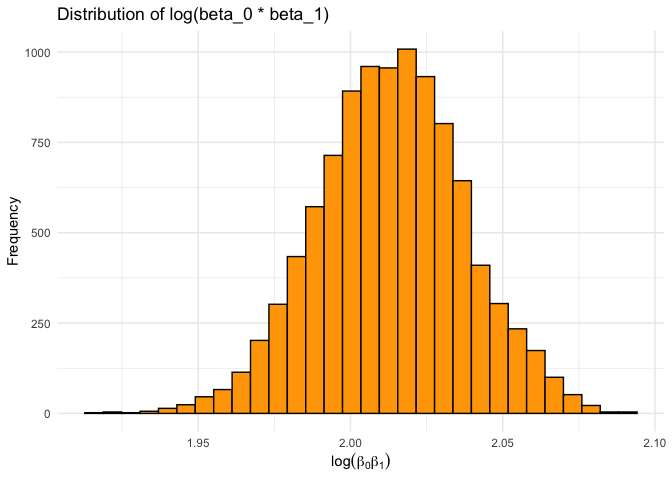
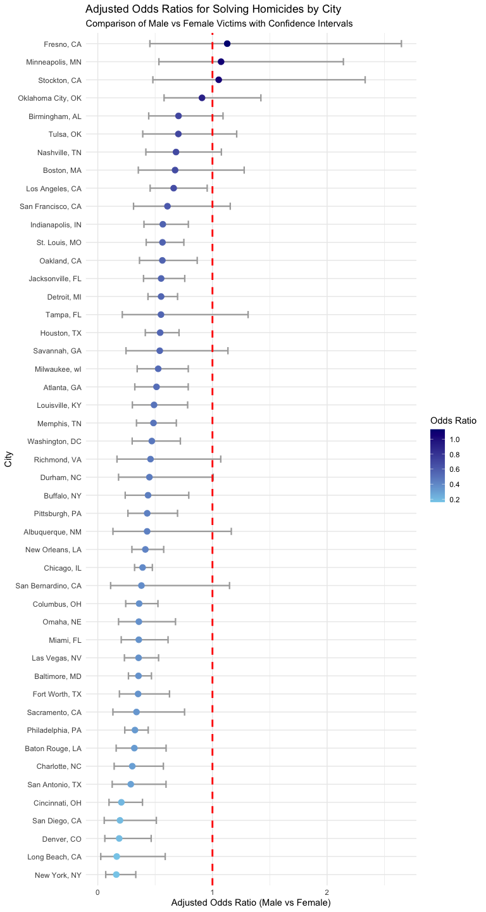
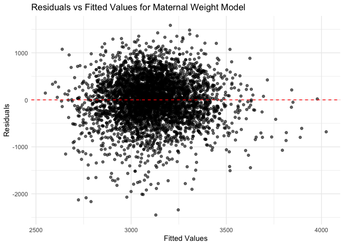
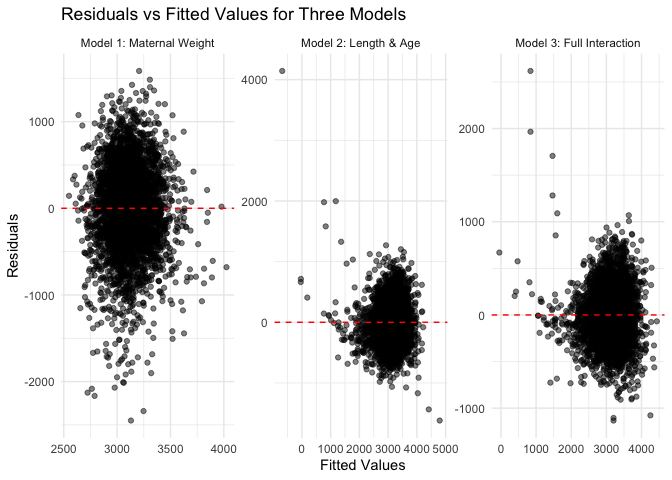
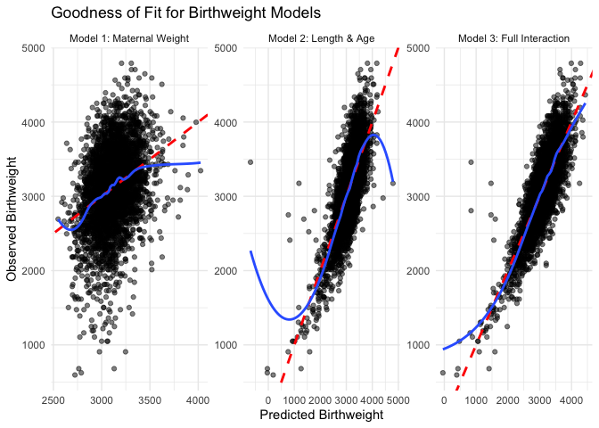
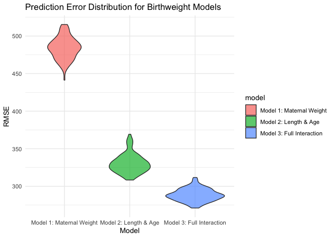

p8105_hw6_bt2654
================
Boxiang Tang
2024-11-28

## Problem 1

### Step 1: Import necessary libraries and load data

``` r
# Load necessary libraries
library(tidyverse)
library(modelr)
library(broom)
set.seed(2654)

# Load the Central Park weather data
weather_df =
  rnoaa::meteo_pull_monitors(
  c("USW00094728"),
  var = c("PRCP", 
          "TMIN", 
          "TMAX"),
  date_min = "2017-01-01",
  date_max = "2017-12-31"
) |>
  mutate(
    name = recode(id,
                  USW00094728 = "CentralPark_NY"),
    tmin = tmin / 10,
    tmax = tmax / 10
  ) |>
  select(name, 
         id, 
         everything())
```

### Step 2: Generate bootstrap samples

``` r
# Generate 5000 bootstrap samples
boot_straps =
  weather_df |>
  modelr::bootstrap(n = 5000)
```

### Step 3: Fit a linear model for each bootstrap sample and extract results

``` r
# Fit a model to each bootstrap sample and extract coefficients and R-squared
bootstrap_results = 
  boot_straps |>
  mutate(
    models = map(strap,
                 ~ lm(tmax ~ tmin,
                      data = .)),
    results = map(models, 
                  broom::tidy),
    r_squared = map_dbl(models,
                        ~ broom::glance(.)$r.squared),
    log_beta_product = 
      map_dbl(models, ~ {
      coefs <- broom::tidy(.)$estimate
      log(abs(coefs[1] * coefs[2]))
    })
  ) %>%
  select(r_squared,
         log_beta_product, 
         results) %>%
  unnest(results)
```

### Step 4: Summarize Bootstrap Statistics and Confidence Intervals

``` r
# Display summary statistics for the bootstrap results
summary_stats = 
  bootstrap_results |>
  select(r_squared, 
         log_beta_product)|>
  summary() 

# Summarize bootstrap results for coefficients
bootstrap_summary =
  bootstrap_results |>
  group_by(term) |>
  summarize(
    boot_se = sd(estimate),  # Standard error for coefficients
    ci_lower = quantile(estimate, 0.025),  # 2.5% quantile
    ci_upper = quantile(estimate, 0.975)   # 97.5% quantile
  )

# Calculate confidence intervals for R-squared and log(beta_0 * beta_1)
ci_r_squared = 
  quantile(bootstrap_results$r_squared, 
                        c(0.025, 0.975))
ci_log_beta_product = 
  quantile(bootstrap_results$log_beta_product, 
                               c(0.025, 0.975))


# Statistics summary for r_squared and log_beta_product
print(summary_stats)
```

    ##    r_squared      log_beta_product
    ##  Min.   :0.8714   Min.   :1.915   
    ##  1st Qu.:0.9061   1st Qu.:1.997   
    ##  Median :0.9120   Median :2.013   
    ##  Mean   :0.9116   Mean   :2.013   
    ##  3rd Qu.:0.9173   3rd Qu.:2.030   
    ##  Max.   :0.9394   Max.   :2.090

``` r
# View summaries and confidence intervals
list(
  coefficient_summary = bootstrap_summary,  # Summary statistics for coefficients
  r_squared_ci = ci_r_squared,  # Confidence interval for R-squared
  log_beta_product_ci = ci_log_beta_product  # Confidence interval for log(beta_0 * beta_1)
)
```

    ## $coefficient_summary
    ## # A tibble: 2 × 4
    ##   term        boot_se ci_lower ci_upper
    ##   <chr>         <dbl>    <dbl>    <dbl>
    ## 1 (Intercept)  0.255      6.72     7.74
    ## 2 tmin         0.0170     1.01     1.07
    ## 
    ## $r_squared_ci
    ##      2.5%     97.5% 
    ## 0.8944007 0.9276583 
    ## 
    ## $log_beta_product_ci
    ##     2.5%    97.5% 
    ## 1.965937 2.061464

#### **Key Statistics of $R^2$**:

- **Mean**: 0.9116
- **Median**: 0.9120
- **95% Confidence Interval**: \[0.8944, 0.9277\]
- **Interpretation**: The results being concentrated around 0.91
  demonstrate the stability and reliability of the relationship between
  the predictor and the response variable in the bootstrap samples. Also
  the narrow confidence interval reflects high consistency and
  reliability of the $R^2$ estimates.

------------------------------------------------------------------------

#### **Key Statistics of $\log(\beta_0 \cdot \beta_1)$**:

- **Mean**: 2.013
- **Median**: 2.013
- **95% Confidence Interval**: \[1.9659, 2.0615\]
- **Interpretation**: The consistent distribution of
  $\log(\beta_0 \cdot \beta_1)$ indicates robust estimates of the
  coefficient product across bootstrap samples, further validating the
  model’s reliability. In addition to that, the narrow confidence
  interval highlights high consistency in the estimates of $\beta_0$ and
  $\beta_1$ across bootstrap samples, confirming their reliability.

### Step 5: Visualize the results

``` r
# Visualize the distribution of R-squared
ggplot(bootstrap_results, 
       aes(x = r_squared)) +
  geom_histogram(bins = 30, 
                 fill = "pink",
                 color = "black") +
  labs(
    title = "Distribution of R-squared",
    x = expression(R^2),
    y = "Frequency"
  ) +
  theme_minimal()
```

``` r
# Visualize the distribution of log(beta_0 * beta_1)
ggplot(bootstrap_results, 
       aes(x = log_beta_product)) +
  geom_histogram(bins = 30,
                 fill = "orange", 
                 color = "black") +
  labs(
    title = "Distribution of log(beta_0 * beta_1)",
    x = expression(log(beta[0] * beta[1])),
    y = "Frequency"
  ) +
  theme_minimal()
```



#### **Figure 1: Distribution of $R^2$**

- **Description**: The distribution of $R^2$ from 5000 bootstrap samples
  is unimodal and approximately normal, with most values clustering
  around the mean $R^2 = 0.9116$. This indicates that $tmin$ explains a
  substantial proportion of the variance in $tmax$ in the bootstrap
  linear regression model.

------------------------------------------------------------------------



#### **Figure 2: Distribution of $\log(\beta_0 \cdot \beta_1)$**

- **Description**: The distribution of $\log(\beta_0 \cdot \beta_1)$ is
  unimodal and approximately normal, with most values clustering around
  the mean $\log(\beta_0 \cdot \beta_1) = 2.013$.

## Problem 2

### Step 1: Data Cleaning and Creating Variables

``` r
# Load necessary packages
library(tidyverse)  # For data manipulation and visualization
library(broom)      # For tidying model outputs
library(purrr)      # For functional programming, e.g., using map()

# Read the homicide data
homicide_data = read_csv("data/homicide-data.csv")

# Step 1: Data cleaning and variable creation
homicide_cleaned =
  homicide_data |>
  mutate(
    city_state = str_c(city, state, sep = ", "),  # Create a city_state variable
    solved = ifelse(str_detect(disposition, "Closed"), 1, 0)  # Create solved binary variable
  ) |>
  filter(
    # Remove specific cities as per the problem instructions
    !city_state %in% c("Dallas, TX", "Phoenix, AZ", "Kansas City, MO", "Tulsa, AL"),
    # Keep only "White" or "Black" victim race
    victim_race %in% c("White", "Black"),
    # Remove rows where victim age is unknown
    victim_age != "Unknown",
    # Remove rows where victim sex is unknown
    victim_sex != "Unknown"
  ) |>
  mutate(
    victim_age = as.numeric(victim_age),  # Convert victim age to numeric
    victim_race = fct_relevel(victim_race, "White")  # Set reference level of victim race to "White"
  )
```

### Step 2: Logistic Regression for Baltimore, MD

``` r
# Step 2: Fit logistic regression for Baltimore, MD
baltimore_data =
  homicide_cleaned |>
  filter(city_state == "Baltimore, MD") |>  # Filter data for Baltimore
  select(solved, victim_age, victim_race, victim_sex)  # Select relevant variables

# Fit the logistic regression model
baltimore_model = 
  glm(solved ~ victim_age + victim_race + victim_sex, 
      data = baltimore_data, 
      family = binomial())

# Tidy the model output and compute adjusted odds ratios (ORs)
baltimore_results =
  tidy(baltimore_model, 
       conf.int = TRUE, 
       exponentiate = FALSE) |>
  mutate(
    adjusted_OR = exp(estimate),  # Calculate adjusted odds ratio
    adjusted_conf.low = exp(conf.low),  # Calculate lower bound of OR confidence interval
    adjusted_conf.high = exp(conf.high)  # Calculate upper bound of OR confidence interval
  ) |>
  select(term, 
         OR = estimate,
         adjusted_OR, 
         conf.low,
         conf.high,
         adjusted_conf.low, 
         adjusted_conf.high, 
         p.value) # Select final output columns


# Display the tidy table
baltimore_results |>
  knitr::kable(digits = 4)
```

| term             |      OR | adjusted_OR | conf.low | conf.high | adjusted_conf.low | adjusted_conf.high | p.value |
|:-----------------|--------:|------------:|---------:|----------:|------------------:|-------------------:|--------:|
| (Intercept)      |  1.5635 |      4.7755 |   1.0899 |    2.0511 |            2.9738 |             7.7764 |  0.0000 |
| victim_age       | -0.0052 |      0.9948 |  -0.0116 |    0.0012 |            0.9885 |             1.0012 |  0.1098 |
| victim_raceBlack | -0.8997 |      0.4067 |  -1.2581 |   -0.5499 |            0.2842 |             0.5770 |  0.0000 |
| victim_sexMale   | -1.0366 |      0.3547 |  -1.3195 |   -0.7595 |            0.2673 |             0.4679 |  0.0000 |

#### Table_1 Comments (Baltimore Analysis)

**1. Key Trends:**

- The adjusted odds ratio for `victim_sexMale` is 0.3547 (95% CI:
  0.2673–0.4679, p = 0.0000), indicating that homicides involving male
  victims are significantly less likely to be resolved compared to
  female victims. This result is statistically significant (p \< 0.05),
  with a narrow confidence interval showing reliable estimates.

**2. Victim Race:**

- The adjusted odds ratio for `victim_raceBlack` is 0.4067 (95% CI:
  0.2842–0.5770, p = 0.0000), showing that cases involving Black victims
  are less likely to be resolved compared to non-Black victims. This
  difference is statistically significant, and the confidence interval
  suggests moderate reliability.

**3. Victim Age:**

- The adjusted odds ratio for `victim_age` is 0.9948 (95% CI:
  0.9885–1.0012, p = 0.1098), indicating that age does not have a
  statistically significant effect on the likelihood of resolving
  homicide cases. The confidence interval includes 1, supporting this
  lack of statistical significance.

**4. Intercept:**

- The adjusted odds ratio for the intercept is 4.7755 (95% CI:
  2.9738–7.7764, p = 0.0000), which represents the baseline odds of
  resolving a case when all other predictors are at their reference
  levels. The wide confidence interval indicates variability, but the
  result is statistically significant.

### Step 3: Logistic Regression for All Cities

``` r
# Step 3: Fit logistic regression for each city
city_models =
  homicide_cleaned |>
  group_by(city_state) |>  # Group by city_state
  nest() |>  # Nest data by city_state
  mutate(
    # Fit logistic regression model for each city
    model = map(data,
                ~ glm(solved ~ victim_age + victim_race + victim_sex, 
                      data = .x, 
                      family = binomial())),
    # Use broom::tidy to extract model results
    model_results = map(model,
                        ~ tidy(.x, 
                               conf.int = TRUE, 
                               exponentiate = FALSE))
  ) |>
  unnest(model_results) |>  # Unnest model results
  filter(term == "victim_sexMale") |>  # Keep only the result for male victims
  mutate(
    adjusted_OR = exp(estimate),  # Calculate adjusted OR
    adjusted_conf.low = exp(conf.low),  # Calculate lower bound of OR confidence interval
    adjusted_conf.high = exp(conf.high)  # Calculate upper bound of OR confidence interval
  ) |>
  select(city_state, 
         OR = estimate, 
         adjusted_OR, 
         conf.low, 
         conf.high, 
         adjusted_conf.low,
         adjusted_conf.high,
         p.value) # Select final output columns

# Display results for city models
city_models |>
  knitr::kable(digits = 4)
```

| city_state         |      OR | adjusted_OR | conf.low | conf.high | adjusted_conf.low | adjusted_conf.high | p.value |
|:-------------------|--------:|------------:|---------:|----------:|------------------:|-------------------:|--------:|
| Albuquerque, NM    | -0.8438 |      0.4301 |  -2.0240 |    0.1522 |            0.1321 |             1.1644 |  0.1219 |
| Atlanta, GA        | -0.6693 |      0.5121 |  -1.1310 |   -0.2374 |            0.3227 |             0.7887 |  0.0032 |
| Baltimore, MD      | -1.0366 |      0.3547 |  -1.3195 |   -0.7595 |            0.2673 |             0.4679 |  0.0000 |
| Baton Rouge, LA    | -1.1432 |      0.3188 |  -1.8318 |   -0.5182 |            0.1601 |             0.5956 |  0.0006 |
| Birmingham, AL     | -0.3510 |      0.7040 |  -0.8118 |    0.0882 |            0.4441 |             1.0922 |  0.1252 |
| Boston, MA         | -0.4045 |      0.6673 |  -1.0474 |    0.2311 |            0.3508 |             1.2600 |  0.2121 |
| Buffalo, NY        | -0.8250 |      0.4382 |  -1.4315 |   -0.2314 |            0.2390 |             0.7935 |  0.0068 |
| Charlotte, NC      | -1.2013 |      0.3008 |  -1.9476 |   -0.5586 |            0.1426 |             0.5720 |  0.0006 |
| Chicago, IL        | -0.9395 |      0.3908 |  -1.1371 |   -0.7427 |            0.3208 |             0.4758 |  0.0000 |
| Cincinnati, OH     | -1.5823 |      0.2055 |  -2.3264 |   -0.9419 |            0.0977 |             0.3899 |  0.0000 |
| Columbus, OH       | -1.0201 |      0.3606 |  -1.4126 |   -0.6450 |            0.2435 |             0.5247 |  0.0000 |
| Denver, CO         | -1.6788 |      0.1866 |  -2.7926 |   -0.7644 |            0.0613 |             0.4656 |  0.0009 |
| Detroit, MI        | -0.5939 |      0.5522 |  -0.8263 |   -0.3628 |            0.4377 |             0.6957 |  0.0000 |
| Durham, NC         | -0.7983 |      0.4501 |  -1.7088 |    0.0068 |            0.1811 |             1.0068 |  0.0650 |
| Fort Worth, TX     | -1.0457 |      0.3514 |  -1.6686 |   -0.4696 |            0.1885 |             0.6252 |  0.0006 |
| Fresno, CA         |  0.1212 |      1.1289 |  -0.7893 |    0.9739 |            0.4541 |             2.6482 |  0.7853 |
| Houston, TX        | -0.6090 |      0.5439 |  -0.8813 |   -0.3446 |            0.4142 |             0.7085 |  0.0000 |
| Indianapolis, IN   | -0.5671 |      0.5672 |  -0.9097 |   -0.2359 |            0.4026 |             0.7898 |  0.0010 |
| Jacksonville, FL   | -0.5934 |      0.5524 |  -0.9192 |   -0.2767 |            0.3988 |             0.7583 |  0.0003 |
| Las Vegas, NV      | -1.0341 |      0.3556 |  -1.4604 |   -0.6346 |            0.2322 |             0.5301 |  0.0000 |
| Long Beach, CA     | -1.8018 |      0.1650 |  -3.6559 |   -0.5311 |            0.0258 |             0.5880 |  0.0173 |
| Los Angeles, CA    | -0.4127 |      0.6619 |  -0.7842 |   -0.0470 |            0.4565 |             0.9541 |  0.0279 |
| Louisville, KY     | -0.7122 |      0.4906 |  -1.1990 |   -0.2438 |            0.3015 |             0.7836 |  0.0034 |
| Memphis, TN        | -0.7223 |      0.4856 |  -1.0865 |   -0.3783 |            0.3374 |             0.6850 |  0.0001 |
| Miami, FL          | -1.0286 |      0.3575 |  -1.5885 |   -0.4897 |            0.2042 |             0.6128 |  0.0002 |
| Milwaukee, wI      | -0.6409 |      0.5268 |  -1.0689 |   -0.2368 |            0.3434 |             0.7892 |  0.0025 |
| Minneapolis, MN    |  0.0726 |      1.0752 |  -0.6292 |    0.7618 |            0.5330 |             2.1422 |  0.8370 |
| Nashville, TN      | -0.3824 |      0.6822 |  -0.8694 |    0.0749 |            0.4192 |             1.0778 |  0.1111 |
| New Orleans, LA    | -0.8804 |      0.4146 |  -1.2125 |   -0.5537 |            0.2975 |             0.5748 |  0.0000 |
| New York, NY       | -1.8244 |      0.1613 |  -2.6720 |   -1.1047 |            0.0691 |             0.3313 |  0.0000 |
| Oakland, CA        | -0.5743 |      0.5631 |  -1.0113 |   -0.1426 |            0.3637 |             0.8671 |  0.0094 |
| Oklahoma City, OK  | -0.0956 |      0.9088 |  -0.5483 |    0.3524 |            0.5779 |             1.4225 |  0.6767 |
| Omaha, NE          | -1.0270 |      0.3581 |  -1.7089 |   -0.3889 |            0.1811 |             0.6778 |  0.0022 |
| Philadelphia, PA   | -1.1265 |      0.3242 |  -1.4473 |   -0.8219 |            0.2352 |             0.4396 |  0.0000 |
| Pittsburgh, PA     | -0.8422 |      0.4308 |  -1.3371 |   -0.3631 |            0.2626 |             0.6956 |  0.0007 |
| Richmond, VA       | -0.7769 |      0.4598 |  -1.7877 |    0.0699 |            0.1673 |             1.0724 |  0.0956 |
| San Antonio, TX    | -1.2456 |      0.2878 |  -2.0748 |   -0.5191 |            0.1256 |             0.5950 |  0.0015 |
| Sacramento, CA     | -1.0866 |      0.3374 |  -2.0268 |   -0.2788 |            0.1318 |             0.7567 |  0.0135 |
| Savannah, GA       | -0.6154 |      0.5404 |  -1.4030 |    0.1267 |            0.2459 |             1.1351 |  0.1120 |
| San Bernardino, CA | -0.9663 |      0.3805 |  -2.1905 |    0.1388 |            0.1119 |             1.1488 |  0.0971 |
| San Diego, CA      | -1.6424 |      0.1935 |  -2.8831 |   -0.6718 |            0.0560 |             0.5108 |  0.0028 |
| San Francisco, CA  | -0.4983 |      0.6075 |  -1.1657 |    0.1442 |            0.3117 |             1.1551 |  0.1336 |
| St. Louis, MO      | -0.5725 |      0.5641 |  -0.8625 |   -0.2868 |            0.4221 |             0.7507 |  0.0001 |
| Stockton, CA       |  0.0531 |      1.0546 |  -0.7333 |    0.8467 |            0.4803 |             2.3320 |  0.8944 |
| Tampa, FL          | -0.5959 |      0.5510 |  -1.5438 |    0.2708 |            0.2136 |             1.3110 |  0.1927 |
| Tulsa, OK          | -0.3531 |      0.7025 |  -0.9365 |    0.1918 |            0.3920 |             1.2114 |  0.2176 |
| Washington, DC     | -0.7508 |      0.4720 |  -1.2027 |   -0.3264 |            0.3004 |             0.7215 |  0.0008 |

#### Table_2 Comments (All Cities Analysis)

**1. Key Trends:**

- The majority of cities have adjusted ORs below 1, indicating that
  homicides involving male victims are less likely to be solved compared
  to female victims. Notably, cities like New York, NY (adjusted OR =
  0.1613) and Long Beach, CA (adjusted OR = 0.1650) show the lowest ORs,
  suggesting significant disparities in resolution rates.

**2. Cities with OR above 1:**

- Exceptions include Fresno, CA (adjusted OR = 1.1289) and Minneapolis,
  MN (adjusted OR = 1.0752), where male victim cases are slightly more
  likely to be resolved than female victim cases. However, these results
  are not statistically significant due to wide confidence intervals and
  high p-values.

**3. Significance of P-Values:**

- Cities like Baltimore, MD (p = 0.0000) and Chicago, IL (p = 0.0000)
  have statistically significant differences (p \< 0.05), indicating
  robust findings.
- By contrast, cities such as Fresno, CA (p = 0.7853) and Minneapolis,
  MN (p = 0.8370) have very high p-values (\> 0.05), making their
  differences statistically insignificant.

**4. Confidence Intervals:**

- Narrow confidence intervals, such as Baltimore, MD (adjusted CI:
  0.2673–0.4679) and Chicago, IL (adjusted CI: 0.3208–0.4758), indicate
  higher reliability of estimates.
- Wide confidence intervals, like Fresno, CA (adjusted CI:
  0.4541–2.6482), highlight greater uncertainty in these estimates.

### Step 4: Plot Adjusted Odds Ratios for Each City

``` r
# Step 4: Plot adjusted odds ratios for each city
ggplot(city_models, 
       aes(x = reorder(city_state, adjusted_OR),
           y = adjusted_OR)) +
  geom_errorbar(aes(ymin = adjusted_conf.low, 
                    ymax = adjusted_conf.high), 
                width = 0.4, color = "darkgray",
                size = 0.8) +  # Plot error bars
  geom_point(aes(color = adjusted_OR),
             size = 3) +  # Plot points with color gradient for OR values
  geom_hline(yintercept = 1,
             linetype = "dashed", 
             color = "red", 
             size = 1) +  # Add reference line for OR = 1
  coord_flip() +  # Flip coordinates to place city names on y-axis
  labs(
    title = "Adjusted Odds Ratios for Solving Homicides by City",
    subtitle = "Comparison of Male vs Female Victims with Confidence Intervals",
    x = "City",
    y = "Adjusted Odds Ratio (Male vs Female)"
  ) +
  scale_color_gradient(low = "skyblue", high = "navyblue", name = "Odds Ratio") +  # Adjust color gradient for OR values
  theme_minimal()  # Apply minimal theme to plot
```



#### Figure Comments

**1. Overall Trends:**

- The figure shows that most cities have adjusted ORs below 1,
  reflecting lower resolution rates for male victims compared to female
  victims. The clustering of ORs between 0.2 and 0.8 further supports
  this trend.

**2. Cities with Extreme ORs:**

- New York, NY (adjusted OR = 0.1613) and Long Beach, CA (adjusted OR =
  0.1650) have the lowest ORs, indicating male victims are significantly
  less likely to have their cases solved compared to female victims.
  These estimates are statistically significant, with narrow confidence
  intervals. On the other hand, Fresno, CA (adjusted OR = 1.1289) and
  Minneapolis, MN (adjusted OR = 1.0752) are exceptions, where male
  victim cases are slightly more likely to be resolved. However, their
  wide confidence intervals and high p-values indicate these differences
  are not statistically significant.

**3. Confidence Interval Observations:**

- Cities like Baltimore, MD and Chicago, IL stand out with tight
  confidence intervals, indicating reliable estimates.
- In contrast, Fresno, CA and Stockton, CA show wide intervals,
  suggesting less reliable estimates.

**4. Red Line Analysis (OR = 1):**

- Cities such as New York, NY and Long Beach, CA are well-separated from
  the red dashed line (OR = 1), highlighting significant differences in
  resolution rates by gender.
- Cities like Stockton, CA and Minneapolis, MN have confidence intervals
  crossing OR = 1, emphasizing the lack of statistical significance.

## Problem 3

### Step 1: Load Libraries and Data & Data Cleaning

``` r
# Load necessary libraries
library(tidyverse)
library(modelr)
library(broom)
library(purrr)

# Load dataset
bwt = read_csv("data/birthweight.csv")

# Data cleaning
# Step 2: Clean and prepare the data for analysis
data_cleaned =
  bwt |>
  mutate(
    # Convert categorical variables to factors
    babysex = factor(babysex,
                     levels = c(1, 2),
                     labels = c("Male",
                                "Female")),
    frace = factor(frace,
                   levels = c(1, 2, 3, 4, 8),
                   labels = c("White", 
                              "Black", 
                              "Asian",
                              "Puerto Rican",
                              "Other")),
    mrace = factor(mrace,
                   levels = c(1, 2, 3, 4, 8),
                   labels = c("White",
                              "Black",
                              "Asian",
                              "Puerto Rican",
                              "Other")),
    malform = factor(malform,
                     levels = c(0, 1),
                     labels = c("Absent",
                                "Present")),
    parity = as.factor(parity),  
    pnumlbw = as.numeric(pnumlbw),  
    pnumsga = as.numeric(pnumsga),
    smoken = as.numeric(smoken)
  ) %>%
  filter(!is.na(bwt)) %>%  
  mutate(across(c(bhead, 
                  blength, 
                  bwt, 
                  delwt,
                  fincome, 
                  gaweeks, 
                  menarche, 
                  mheight, 
                  momage, 
                  ppbmi, 
                  ppwt, 
                  wtgain), 
                as.numeric))
```

### Step 2: Build and Analyze the Custom Model (Model 1)

#### Custom Model Initial Explanation

- The custom model `bwt ~ ppwt * delwt` was built based on the
  hypothesis that both pre-pregnancy weight (`ppwt`) and weight at
  delivery (`delwt`) significantly influence birthweight, and their
  combined effect might reveal additional insights. The interaction term
  `ppwt * delwt` was included to explore whether the effect of maternal
  weight at delivery on birthweight depends on the mother’s
  pre-pregnancy weight, as these two factors are biologically
  interconnected and jointly impact fetal growth.

``` r
# Model 1: Custom maternal weight model
model_maternal_weight = 
  lm(bwt ~ ppwt * delwt, 
     data = data_cleaned)

# Add predictions and residuals for custom model
data_cleaned =
  data_cleaned |>
  add_predictions(model_maternal_weight, 
                  var = "fitted_maternal_weight") |>
  add_residuals(model_maternal_weight,
                var = "residuals_maternal_weight")

# Plot residuals against fitted values for custom model
ggplot(data_cleaned, 
       aes(x = fitted_maternal_weight, 
           y = residuals_maternal_weight)) +
  geom_point(alpha = 0.6) +
  geom_hline(yintercept = 0, 
             linetype = "dashed",
             color = "red") +
  labs(
    title = "Residuals vs Fitted Values for Maternal Weight Model",
    x = "Fitted Values",
    y = "Residuals"
  ) +
  theme_minimal()
```

``` r
# Summarize the custom model (model 1)
summary(model_maternal_weight)
```

    ## 
    ## Call:
    ## lm(formula = bwt ~ ppwt * delwt, data = data_cleaned)
    ## 
    ## Residuals:
    ##      Min       1Q   Median       3Q      Max 
    ## -2449.56  -279.08    23.58   311.91  1585.02 
    ## 
    ## Coefficients:
    ##               Estimate Std. Error t value Pr(>|t|)    
    ## (Intercept)  1.183e+03  1.800e+02   6.569 5.67e-11 ***
    ## ppwt         1.034e+00  1.566e+00   0.660    0.509    
    ## delwt        1.852e+01  1.251e+00  14.810  < 2e-16 ***
    ## ppwt:delwt  -4.858e-02  8.206e-03  -5.919 3.48e-09 ***
    ## ---
    ## Signif. codes:  0 '***' 0.001 '**' 0.01 '*' 0.05 '.' 0.1 ' ' 1
    ## 
    ## Residual standard error: 483.6 on 4338 degrees of freedom
    ## Multiple R-squared:  0.1091, Adjusted R-squared:  0.1085 
    ## F-statistic: 177.1 on 3 and 4338 DF,  p-value: < 2.2e-16



#### 1. Residual Plot Comments：

- The residual plot shows the residuals versus the fitted values for the
  custom model:
  - The residuals appear randomly scattered around the red dashed line
    at zero, indicating that the model captures the linear relationship
    between predictors and birthweight reasonably well.
  - The spread of residuals is slightly uneven, with some larger
    residuals at higher fitted values, suggesting potential
    heteroscedasticity.
  - There are no clear patterns or systematic deviations, indicating no
    severe model misspecification.

------------------------------------------------------------------------

#### 2. Summary Results Comments：

- **Coefficients**:
  - `ppwt` (pre-pregnancy weight) is not statistically significant
    ($p = 0.509$), meaning its effect on birthweight is uncertain when
    controlling for `delwt`.
  - `delwt` (maternal weight at delivery) is highly significant
    ($p < 2e-16$), indicating it has a strong positive relationship with
    birthweight.
  - The interaction term (`ppwt:delwt`) is significant ($p < 0.001$),
    suggesting the effect of `delwt` on birthweight depends on the value
    of `ppwt`.
- **Model Fit**:
  - The $R^2$ value is 0.109, which indicates the model explains about
    10.9% of the variability in birthweight. This suggests additional
    predictors might improve the model.
  - The residual standard error of 483.6 grams is relatively large,
    indicating variability in birthweight that the model cannot explain.

### Step 3: Build Models 2 and 3

``` r
# Model 2: Birth length and gestational age
model_length_age =
  lm(bwt ~ blength + gaweeks + blength:gaweeks, 
     data = data_cleaned)

# Model 3: Head circumference, length, and sex
model_full =
  lm(bwt ~ bhead * blength * babysex, 
     data = data_cleaned)


# Summarize model 2 & model 3
summary(model_length_age)
```

    ## 
    ## Call:
    ## lm(formula = bwt ~ blength + gaweeks + blength:gaweeks, data = data_cleaned)
    ## 
    ## Residuals:
    ##     Min      1Q  Median      3Q     Max 
    ## -1619.6  -214.5   -12.5   208.1  4143.6 
    ## 
    ## Coefficients:
    ##                  Estimate Std. Error t value Pr(>|t|)    
    ## (Intercept)     -7545.926    750.755 -10.051  < 2e-16 ***
    ## blength           194.435     15.461  12.576  < 2e-16 ***
    ## gaweeks           111.526     19.736   5.651 1.70e-08 ***
    ## blength:gaweeks    -1.736      0.404  -4.297 1.77e-05 ***
    ## ---
    ## Signif. codes:  0 '***' 0.001 '**' 0.01 '*' 0.05 '.' 0.1 ' ' 1
    ## 
    ## Residual standard error: 332.5 on 4338 degrees of freedom
    ## Multiple R-squared:  0.5787, Adjusted R-squared:  0.5784 
    ## F-statistic:  1986 on 3 and 4338 DF,  p-value: < 2.2e-16

``` r
summary(model_full)
```

    ## 
    ## Call:
    ## lm(formula = bwt ~ bhead * blength * babysex, data = data_cleaned)
    ## 
    ## Residuals:
    ##      Min       1Q   Median       3Q      Max 
    ## -1132.99  -190.42   -10.33   178.63  2617.96 
    ## 
    ## Coefficients:
    ##                               Estimate Std. Error t value Pr(>|t|)    
    ## (Intercept)                 -7176.8170  1264.8397  -5.674 1.49e-08 ***
    ## bhead                         181.7956    38.0542   4.777 1.84e-06 ***
    ## blength                       102.1269    26.2118   3.896 9.92e-05 ***
    ## babysexFemale                6374.8684  1677.7669   3.800 0.000147 ***
    ## bhead:blength                  -0.5536     0.7802  -0.710 0.478012    
    ## bhead:babysexFemale          -198.3932    51.0917  -3.883 0.000105 ***
    ## blength:babysexFemale        -123.7729    35.1185  -3.524 0.000429 ***
    ## bhead:blength:babysexFemale     3.8781     1.0566   3.670 0.000245 ***
    ## ---
    ## Signif. codes:  0 '***' 0.001 '**' 0.01 '*' 0.05 '.' 0.1 ' ' 1
    ## 
    ## Residual standard error: 287.7 on 4334 degrees of freedom
    ## Multiple R-squared:  0.6849, Adjusted R-squared:  0.6844 
    ## F-statistic:  1346 on 7 and 4334 DF,  p-value: < 2.2e-16

``` r
# Add predictions and residuals for all models
data_cleaned =
  data_cleaned |>
  add_predictions(model_maternal_weight, 
                  var = "fitted_maternal_weight") |>
  add_residuals(model_maternal_weight, 
                var = "residuals_maternal_weight") |>
  add_predictions(model_length_age, 
                  var = "fitted_length_age") |>
  add_residuals(model_length_age, 
                var = "residuals_length_age") |>
  add_predictions(model_full, 
                  var = "fitted_full") |>
  add_residuals(model_full, 
                var = "residuals_full")
```

#### Comments on Model 2 and Model 3 Outputs

##### 1. Model 2: Length & Age

- **Summary Results Comments**:
  - **Coefficients**:
    - `blength` (birth length) and `gaweeks` (gestational weeks) are
      both highly significant ($p < 2e-16$ and $p = 1.70e-08$,
      respectively), showing strong positive relationships with
      birthweight.
    - The interaction term `blength:gaweeks` is also significant
      ($p < 0.001$), indicating that the relationship between birth
      length and birthweight depends on gestational weeks.
  - **Model Fit**:
    - The $R^2$ value is 0.578, meaning the model explains 57.8% of the
      variability in birthweight, a substantial improvement over Model
      1.
    - The residual standard error is 332.5 grams, lower than Model 1,
      indicating better predictive accuracy.

------------------------------------------------------------------------

##### 2. Model 3: Full Interaction

- **Summary Results Comments**:
  - **Coefficients**:
    - `bhead` (head circumference), `blength` (birth length), and
      `babysexFemale` (baby’s sex) are all statistically significant,
      indicating these predictors contribute meaningfully to birthweight
      ($p < 0.001$).
    - Several interaction terms are also significant, such as
      `bhead:babysexFemale` and `blength:babysexFemale`, suggesting
      complex relationships among head circumference, length, and sex in
      their influence on birthweight.
  - **Model Fit**:
    - The $R^2$ value is 0.684, meaning this model explains 68.4% of the
      variability in birthweight, the highest among the three models.
    - The residual standard error is 287.7 grams, the lowest of all
      models, indicating the best predictive accuracy.

### Step 4: Compare Residuals for All Models

``` r
# Combine residuals for all models
residuals_combined =
  data_cleaned |>
  select(fitted_maternal_weight,
         residuals_maternal_weight, 
         fitted_length_age,
         residuals_length_age, 
         fitted_full, 
         residuals_full) |>
  pivot_longer(cols = everything(),
               names_to = c(".value", 
                            "model"), 
               names_pattern = "(fitted|residuals)_(.*)")

# Update model names for titles
residuals_combined =
  residuals_combined |>
  mutate(model = recode(model,
                        maternal_weight = "Model 1: Maternal Weight",
                        length_age = "Model 2: Length & Age",
                        full = "Model 3: Full Interaction"))

# Plot residuals vs fitted values for each model
ggplot(residuals_combined, 
       aes(x = fitted,
           y = residuals)) +
  geom_point(alpha = 0.5) +
  geom_hline(yintercept = 0, 
             linetype = "dashed", 
             color = "red") +
  facet_wrap(~ model, 
             scales = "free", 
             ncol = 3) +
  labs(
    title = "Residuals vs Fitted Values for Three Models",
    x = "Fitted Values",
    y = "Residuals"
  ) +
  theme_minimal()
```



#### Residual Plot Comparison

- **Comments**:
  - **Model 1 (Maternal Weight)**:
    - The residuals are more widely scattered, with larger variance
      compared to the other two models.
    - Indicates weaker predictive performance, as reflected by the
      higher residual standard error and lower $R^2$.
  - **Model 2 (Length & Age)**:
    - The residuals are less spread compared to Model 1, reflecting
      improved fit and predictive accuracy.
    - The scatter is still slightly uneven, with some clustering at
      specific fitted values.
  - **Model 3 (Full Interaction)**:
    - The residuals are the most tightly clustered around the zero line,
      suggesting the best fit among the three models.
    - This aligns with its higher $R^2$ and lower residual standard
      error, making it the most accurate model.

### Step 5: Goodness of Fit

``` r
# Combine predictions for all models
data_cleaned_with_predictions = 
  data_cleaned |>
  gather_predictions(model_maternal_weight,
                     model_length_age, 
                     model_full) |>
  mutate(model = recode(model,
                        model_maternal_weight = "Model 1: Maternal Weight",
                        model_length_age = "Model 2: Length & Age",
                        model_full = "Model 3: Full Interaction"))

# Plot Goodness of Fit
ggplot(data_cleaned_with_predictions,
       aes(x = pred, y = bwt)) +
  geom_point(alpha = 0.5) +
  geom_abline(slope = 1,
              intercept = 0,
              color = "red",
              linetype = "dashed",
              size = 1) +  
  geom_smooth(method = "loess",
              span = 0.3, 
              se = FALSE,)+
  facet_wrap(~ model, 
             scales = "free") +
  labs(
    title = "Goodness of Fit for Birthweight Models",
    x = "Predicted Birthweight",
    y = "Observed Birthweight"
  ) +
  theme_minimal()
```



#### Comments on Goodness of Fit Plot

- **Overall Observations**:
  - The goodness of fit plot compares observed birthweight against
    predicted birthweight for all three models.
  - The red dashed line ($y = x$) represents the ideal fit where
    observed values perfectly match predicted values.
  - The blue LOESS curve visualizes the actual relationship between
    observed and predicted values for each model.

------------------------------------------------------------------------

##### Model 1: Maternal Weight

- **Observations**:
  - The LOESS curve deviates significantly from the red dashed line,
    especially at lower and higher predicted values.
  - Indicates systematic underfitting at extreme birthweights,
    highlighting the limitations of using only maternal weight and
    delivery weight as predictors.

------------------------------------------------------------------------

##### Model 2: Length & Age

- **Observations**:
  - The LOESS curve aligns more closely with the red dashed line
    compared to Model 1, indicating improved fit.
  - Slight deviations at the extremes suggest some underfitting at very
    low and very high birthweights.

------------------------------------------------------------------------

##### Model 3: Full Interaction

- **Observations**:
  - The LOESS curve nearly overlaps with the red dashed line, showing
    the best alignment among the three models.
  - This suggests that the full interaction model provides the most
    accurate predictions across the range of observed birthweights.

------------------------------------------------------------------------

##### Conclusion

- **Summary**:
  - Model 3 demonstrates the best goodness of fit due to its higher
    predictive accuracy and ability to capture complex interactions.
  - Model 2 performs better than Model 1 but still shows minor
    underfitting at extreme birthweights.

### Step 6: Cross-Validation and RMSE Comparison

``` r
# Cross-validation for model comparison
set.seed(123)
cv_results =
  crossv_mc(data_cleaned, 100) |>
  mutate(
    train = map(train, as_tibble),
    test = map(test, as_tibble),
    maternal_weight_mod = map(train,
                              ~ lm(bwt ~ ppwt * delwt,
                                   data = .)),
    length_age_mod = map(train,
                         ~ lm(bwt ~ blength + gaweeks + blength:gaweeks,
                              data = .)),
    full_mod = map(train,
                   ~ lm(bwt ~ bhead * blength * babysex,
                        data = .))
  ) %>%
  mutate(
    rmse_maternal_weight = map2_dbl(maternal_weight_mod,
                                    test,
                                    ~ sqrt(mean((.y$bwt - predict(.x, newdata = .y))^2))),
    rmse_length_age = map2_dbl(length_age_mod,
                               test,
                               ~ sqrt(mean((.y$bwt - predict(.x, newdata = .y))^2))),
    rmse_full = map2_dbl(full_mod,
                         test,
                         ~ sqrt(mean((.y$bwt - predict(.x, newdata = .y))^2)))
  )

# Summarize RMSE results
cv_summary =
  cv_results |>
  summarize(
    mean_rmse_maternal_weight = mean(rmse_maternal_weight),
    mean_rmse_length_age = mean(rmse_length_age),
    mean_rmse_full = mean(rmse_full)
  )

cv_summary |>
  knitr::kable()
```

| mean_rmse_maternal_weight | mean_rmse_length_age | mean_rmse_full |
|--------------------------:|---------------------:|---------------:|
|                  484.0485 |             330.2916 |       288.3849 |

``` r
# Plot RMSE distribution
cv_results |>
  pivot_longer(cols = starts_with("rmse"),
               names_to = "model",
               values_to = "rmse") |>
  mutate(model = recode(model,
                        rmse_maternal_weight = "Model 1: Maternal Weight",
                        rmse_length_age = "Model 2: Length & Age",
                        rmse_full = "Model 3: Full Interaction")) |>
  ggplot(aes(x = model, 
             y = rmse, 
             fill = model)) +
  geom_violin(alpha = 0.7) +
  labs(
    title = "Prediction Error Distribution for Birthweight Models",
    x = "Model",
    y = "RMSE"
  ) +
  theme_minimal()
```

#### 1. Comments on RMSE Results Table：

1.  The table summarizes the mean RMSE values for the three models,
    allowing for straightforward performance comparison.
2.  Model 1: Maternal Weight has the highest RMSE (484.05), indicating
    relatively poor predictive performance.
3.  Model 2: Length & Age shows improvement with a lower RMSE (330.29),
    suggesting more accurate predictions.
4.  Model 3: Full Interaction achieves the best performance with the
    lowest RMSE (288.38), highlighting the importance of interaction
    terms in the model.

------------------------------------------------------------------------



#### 2. Comments on RMSE Distribution Plot：

1.  The violin plot effectively illustrates the RMSE distribution for
    each model, highlighting variability in prediction errors.
2.  Model 1: Maternal Weight has the widest distribution, reflecting
    high variability and less reliable predictions.
3.  Model 2: Length & Age has a narrower spread, indicating more
    consistent predictions with reduced error variability.
4.  Model 3: Full Interaction has the narrowest and lowest distribution,
    confirming its superior predictive accuracy and robustness.
